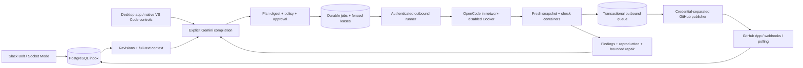

# ◈ ShadowQA

**Team edition — Slack and GitHub context → Gemini plan → approval → isolated OpenCode session → independent checks → repair PR.**

**Individual edition — ChatGPT, Claude, Claude Code and Codex context → Gemini plan → approval → a session in the coding tool you already use → verified diff.**

**ShadowQA Live — the running web app → captured incident → Claude diagnosis (GPT fallback) → risk-graded patch → replay-verified fix → the same findings list, under the same automation mode.**

ShadowQA is a TypeScript service, a desktop app, a local Docker runner, a thin VS Code extension, and — for the individual edition — a Manifest V3 browser side panel and a local companion. Ordinary activity accumulates as source-linked context; pressing **Generate plan** in the desktop app starts planning. Gemini is the sole inference provider for planning in both editions.

This was originally built CLI-first (see the historical **REVISIONS TO PLAN** in [doc.md](doc.md)); the desktop app in [`desktop/`](desktop/) later replaced the terminal entirely as the product's interface — every command the CLI offered has a screen, and no manual `.env` editing or file-based configuration is part of the normal path anymore. §18 of [doc.md](doc.md) records that change and why.

Plans and checks cover the code. **ShadowQA Live** ([`live/`](live/README.md)) covers the running application: a browser SDK or Chrome extension watches clicks, requests, console output and exceptions on localhost, joins them into one incident, and a Python bridge diagnoses, patches, validates and replays the exact interaction before anything is called fixed. Live reports every incident to the ShadowQA service as a `detector: "live"` finding, obeys the project's automation mode, and takes approve/undo/pr/dismiss from the desktop app's Live tab, which also starts and stops the bridge process. It is the product's autonomous fixer for runtime bugs.

Both editions share one codebase, one PostgreSQL schema, one policy engine and one verification path; they keep their data in separate tenants. The individual edition lives in [`individual/`](individual/README.md) and defaults to an embedded PostgreSQL engine, so it needs no Docker and no database server — the desktop app runs it in-process.

The launch film and the slide deck are in [`deliverables/`](deliverables/): `deliverables/shadowqa.mp4` and `deliverables/shadowqa-slides.pdf`. The brand rules are in [docs/BRAND.md](docs/BRAND.md).

Start with [SETUP.md](SETUP.md). The account-free demos are available immediately (these are standalone scripts, not the desktop app, and need no accounts):

```powershell
npm ci
npm run build
npm run demo                          # team edition
npx tsx scripts/individual-demo.ts    # individual edition
```

The demo uses a real embedded PostgreSQL engine, Git snapshots, and actual Node tests. Its model output and repair are scripted fixtures: it does not call Gemini, impersonate a live OpenCode run, or open a GitHub PR. The separate `npm run test:sandbox` contract test uses real Docker and the pinned OpenCode server.

## The desktop app

```powershell
npm ci
npm run desktop:build
npx electron dist-desktop/desktop/electron/main.js
# or, for hot reload while developing the app itself:
npm run desktop:dev
```

Onboarding is **Welcome → Solo or Team → connect integrations → "ShadowQA is watching" → Generate plan → launch agent**:

1. **Welcome.** Choose Solo (this machine only, reads your AI conversations) or Team (Slack + GitHub, shared with your team).
2. **Connect.** Every integration is connected from inside the app or your system browser — nothing is written to a project `.env` file, and nothing asks you to visit a local port:
   - **GitHub** uses GitHub's own [App Manifest flow](https://docs.github.com/en/apps/sharing-github-apps/registering-a-github-app-from-a-manifest): the app opens an auto-submitting form to `github.com`, GitHub creates the App and redirects back to a one-time local loopback listener the app opened for exactly this purpose (the same pattern `gh auth login` uses — you never see or type that address), and the app id, private key and webhook secret come back automatically over GitHub's API. Nothing is copied by hand.
   - **Slack** has no equivalent app-creation API, so the one manual step is pasting a pre-filled app manifest into Slack's own "create from manifest" screen; installing to a workspace shows the bot token right there, and generating a Socket Mode app-level token (the one credential Slack only issues from its own page) is the single unavoidable paste. Both are validated live and stored in the OS keychain, never a file.
   - **Anthropic / OpenAI / Gemini** keys are pasted into a masked field with a "Get a key" link to the provider's console — no OAuth exists for these anywhere, so this is the same pattern every desktop AI tool uses. Validated with a live call, stored in the OS keychain.
   - **Solo's** Claude Code / Codex detection and browser-extension pairing (a short numeric code, not a token) work the same way, no typing a path or editing a config file.
3. **"ShadowQA is watching."** A dashboard shows sources, connection health, Gemini usage and the kill switch, replacing the old interactive terminal command center.
4. **Generate plan.** One button compiles confirmed context into a plan; review it (steps, affected files, acceptance criteria, risk flags, open questions) and Approve or Reject.
5. **Launch agent.** Approval enqueues a job; its detail screen shows live progress, the verified diff, the exact command to open the same session in your IDE terminal, Cancel, and Open PR.

Solo's local service (embedded PostgreSQL, planning, execution, QA) runs inside the desktop app's own process for as long as it is open — there is no separate `serve` step to remember. Team's shared backend needs one always-on machine reachable by the whole team; an administrator either starts it from the desktop app itself (which can also start a local Postgres via Docker Compose with one click) or points every teammate's app at an already-running one started headlessly with `npm run serve:team` (see below). A teammate who is only joining an existing team just pastes the service URL and the member token their admin issued — no GitHub/Slack setup on their part at all.

## Headless / server deployment

The desktop app is the normal interface, but the team edition's shared backend, and a Docker execution runner, are ordinary long-running services that don't need a GUI and can run on a server:

```powershell
npm run serve:team          # API + durable worker + Slack Socket Mode + GitHub reconciliation
npm run runner:map          # on a runner machine: review and consent to one repository mapping
npm run runner:start        # on a runner machine: lease and execute approved jobs
```

`serve:team` reads the same environment variables and `shadowqa.config.json` the desktop app's admin flow writes into (or that you configure directly per [SETUP.md](SETUP.md)); the desktop app is simply a friendlier way to do the same first-run bootstrap. A runner is always a separate, dedicated machine — the administrator registers it from the desktop app's Admin tab (issues a runner credential) and then runs the two commands above on that machine.

## Automation modes

| Mode | Observe/check | Edit | Publish | Merge |
| --- | --- | --- | --- | --- |
| `observe` | Yes, when a reviewed runner profile is available | No | No repair PR | Never |
| `approval` | Yes | Exact user-approved plan | After independent verification | Human |
| `auto-fix` | Yes | Only configured automatic paths with no detected risk flags | After independent verification | Human |
| `full-auto` | Yes | Same restricted automatic scope | After independent verification | Explicit merge policy, exact head/checks, and repository rules required |

An approval binds the actor to an immutable plan digest, repository SHA, command-profile digest, policy version, and expiry. Source edits, deletion, revocation, configuration changes, or a default-branch update invalidate affected execution. No model-generated shell command becomes an execution permission. Changing a project's mode (a dropdown in the desktop app's project screen) invalidates existing approvals.

The runner creates independent copies of committed files. It never applies a repair to the developer's original clone. Dirty originals block repair with a commit/stash instruction. Jobs sleep in the durable queue when no runner is available. Closing the desktop app stops Solo's in-process service (and, if it was administering one, Team's); a headless `serve:team`/runner pair keeps running independently of anyone's desktop app.

Mode changes invalidate existing approvals. Automatic modes can start a bounded repair for a reproduced standing-QA finding under the administrator who enabled that policy. They **do not turn every Slack message into a coding task**. Source-driven planning still starts with pressing Generate plan. Two failed repair proposals/attempts for a finding, cooldowns, daily caps, risk flags, missing prerequisites, or exhausted Gemini quota stop further automation.

The same four modes govern Live. `observe` → Live diagnoses and never writes; `approval` → a patch waits for approval in the Live tab; `auto-fix` and `full-auto` → only LOW-risk patches apply on their own, and every applied patch is still replay-verified with an automatic rollback on failure. The mapping is `MODE_TO_AUTONOMY` in `live/backend/shadowqa/config.py` and mirrored in `src/live/local.ts`; Live reads it from `GET /live/policy/:project` and falls back to its local setting only while the service is unreachable.

Protected paths are excluded from automated publication even after execution approval. Authentication, billing, dependencies, infrastructure, test changes and other sensitive content carry deterministic risk flags. Default automatic paths contain documentation only. Assertion removal, test disabling patterns, binary patches, renames, deletions, symlinks, submodules and changes outside the exact plan require manual handling. Broaden a profile deliberately, review it on both service and runner, and compile a new plan.

## Architecture



The initial deployment is a local/team pilot: the service can read registered clones to inspect repository files; the runner independently maps permitted project IDs to local clones. Remote runner connections use HTTPS and outbound authenticated API calls. A remote runner does not make a service-side clone unnecessary for planning in this implementation.

PostgreSQL is authoritative. Full-text retrieval filters tenant/project first. Project membership grants access to that project's selected sources, including its configured private channels. Configure separate projects/audiences for groups that must not share private context. Derived context remains in that audience. PR text uses an administrator-approved, fixed safe summary and verification metadata, never Slack excerpts or the model's private-context objective.

### Execution and isolation

1. The runner validates its local repository mapping, command-profile digest, pinned OpenCode version, and Docker Linux engine.
2. It leases one job per repository with a fencing token, 60-second lease, and 10-second heartbeat.
3. Git object reads export regular files at the approved SHA. Hooks, repository configuration and credential files are excluded from execution setup. Original files remain untouched.
4. Baseline checks execute as UID 1000 in containers with no network, dropped capabilities, read-only root, bounded CPU/memory/PIDs, and only isolated workspace mounts.
5. The OpenCode server uses the pinned SDK adapter. Its session ID is recorded before prompting. An authenticated host-loopback bridge lets the IDE (or the desktop app's job detail screen) attach to that exact session.
6. The agent has file tools, but no shell, external web tools, MCP integrations or subagent permissions. The administrator's check profile supplies executable argument arrays.
7. OpenCode is paused while the runner freezes the diff. A fresh snapshot receives the patch and runs the approved checks in separate containers. Process exit codes, timeouts, required-check presence, patch scope, possible secrets, and tracked-file mutations are checked independently.
8. The publisher repeats freshness and authorization checks, rebuilds the changed file contents from the frozen patch, writes Git objects to a dedicated `shadowqa/<job-id>` branch, and creates one source-safe PR. Deterministic commit metadata, branch names and PR markers allow retry reconciliation.
9. Full-auto merging checks the actual PR head, latest required results, current default branch, active authorization, and both current/legacy branch rules. Required human review blocks auto-merge. A merged repair is checked again at its merge SHA.

The network-disabled sandbox uses file queues for two narrow transports: local OpenCode HTTP/SSE and Gemini model requests. The guest-side bridge is `infra/bridge.mjs`; the host-side bridge is `src/runner/bridge.ts`. No Gemini key, Slack token, GitHub key, host home directory, SSH agent, or Docker socket is mounted in the agent. Gemini requests return through a leased-job endpoint restricted to the configured model and daily call budget.

Containers are a security boundary; copying a worktree by itself is not. Use dedicated runner machines for code you do not trust. Repository/test code still runs and must be reviewed as part of the execution profile. Docker does not impose a hard disk quota on the host bind mount; see the operating limits below.

## ShadowQA Live — the running app

```mermaid
flowchart LR
  App[Your web app on localhost] --> SDK[shadowqa.js / Chrome extension]
  SDK -->|click · request · console · exception| Bridge[Live bridge · FastAPI]
  Bridge --> Diag[Claude diagnosis · GPT fallback]
  Diag --> Patch[Minimal patch + risk grade]
  Patch --> Gate{project mode}
  Gate -->|approval| Wait[awaiting approval in the Live tab]
  Gate -->|auto-fix · LOW risk| Apply[checkpoint → apply]
  Wait --> Apply
  Apply --> Validate[lint · tests]
  Validate --> Replay[replay the exact interaction]
  Replay -->|pass| Verified[verified → PR]
  Replay -->|fail| Rollback[automatic rollback]
  Bridge <-->|incidents · policy · actions| Service[ShadowQA service /live]
  Service --> Findings[Findings screen]
```



The desktop app's **Live** tab starts the bridge the first time you open it (creating `live/backend/.venv` on first run, exactly like the old `shadowqa live start` did), then shows:

- **Incidents.** A list of everything Live has captured, each opening into full detail: the failing route, the diagnosed root cause, the proposed patch, its risk grade, and — once verified — the pull request link.
- **Approve → apply, validate, replay.** One button drives the same pipeline: apply the patch behind a Git checkpoint, run the workspace's linters and tests, replay the exact recorded interaction against the running app, and verify or automatically roll back.
- **Undo / Open pull request / Dismiss.** The remaining actions a `diagnosed`/`verified` incident can take, matching the project's automation mode.
- **Snippet.** A copy button for the `<script>` tag (or the Chrome extension instructions) that connects an app to Live.

Live reports every state change to the ShadowQA service (`POST /live/projects/:id/incidents`), so a runtime incident is a finding with `rule: live:<route>` and appears beside check failures in the Findings tab; repairing a Live-sourced finding there delegates to the bridge under the same mode rules.

- **Capture.** `live/extension/shadowqa.js` (served by the bridge at `/shadowqa.js`) and the Chrome MV3 extension record the interaction, its network requests, console output and exceptions. Only localhost origins are watched.
- **Correlate.** The failing click, the request it caused and the exception it produced are joined into one incident — frontend and backend together — with source maps pointing at the real file and line.
- **Diagnose.** Anthropic is the primary model and OpenAI the fallback (`SHADOWQA_PRIMARY_MODEL`, `SHADOWQA_FALLBACK_MODEL`); a Gemini key adds an optional third. Keys are sent in headers, never URLs, and every prompt/response is logged.
- **Patch · grade.** The patch is minimal and graded LOW/MEDIUM/HIGH from deterministic rules (`live/backend/shadowqa/risk.py`): size, file count, sensitive paths such as auth, payments, schema and config.
- **Validate · replay.** Behind a Git checkpoint, the workspace's linters and tests run; then the recorded interaction is replayed against the running app. A failed replay rolls back automatically.

The bridge keeps its state in Mongo when `MONGO_URL` is set and in a local JSON store otherwise; no database is required for local use. The demo storefront ("Lumen Supply Co.", `live/frontend`) ships with a deliberately broken checkout so the whole loop can be exercised offline; `SHADOWQA_DEMO=0` disables its routes.

## Code map

Every authored code module is listed here. [docs/CODE_REFERENCE.md](docs/CODE_REFERENCE.md) provides a generated declaration/method index with line numbers (`npm run docs:code` regenerates it). [docs/API.md](docs/API.md) documents HTTP contracts; [SETUP.md](SETUP.md) documents configuration and deployment.

| File | Responsibility |
| --- | --- |
| `src/core/contracts.ts` | Zod schemas for projects, profiles, policies, plans, checks, artifacts, IDs and job states; shared TypeScript types. |
| `src/core/config.ts` | Environment defaults and JSON configuration parsing; duplicate repository/channel detection and profile validation. |
| `src/core/security.ts` | Canonical hashing, random capabilities, constant-time signatures, token/control-character redaction, path containment, ACL checks and HTTPS enforcement. |
| `src/core/connect.ts` | Slack/GitHub live verification (bot token, App JWT, installations, repositories), the GitHub App Manifest conversion, and clone-origin verification — used by the desktop app's connect flows. |
| `src/core/bootstrap.ts` | First-run workspace initialization: registers configured projects and mints the first administrator credential, idempotent per tenant. |
| `src/core/client.ts` | The team API's thin REST transport and OS-keychain credential storage, used by the runner, the headless scripts and (via IPC) the desktop app. |
| `src/core/brand.ts` | The two-colour brand palette and glyphs, read by the desktop app's theme, the film and the slide deck, so every surface stays one brand by construction. |
| `src/db/schema.ts` | Versioned PostgreSQL schema, durable inbox/outbox, sources/revisions, approvals, jobs/events, credentials, full-text index, audit and model usage. |
| `src/db/database.ts` | PostgreSQL pool/transactions, tenant-scoped entity access, authentication, audit, outbound intents and retry backoff. |
| `src/memory/sources.ts` | Delivery deduplication, monotonic source revisions, confirmation, full-text retrieval, deletion/revocation, retention and derived-context invalidation. |
| `src/adapters/slack.ts` | Durable Bolt Socket Mode receiver; ordinary messages, threads, edits/deletes, scoped history/replies pagination, gap records and idempotent status reporting. |
| `src/adapters/github.ts` | GitHub App JWT/installation tokens, scoped REST requests, pagination, ETags/rate backoff, webhook normalization, PR/check hydration and reconciliation. |
| `src/model/gemini.ts` | Bounded structured Gemini calls, schema repair once, sanitized prompt input, content-hash cache, token/call accounting and quota pauses. |
| `src/planner/inspect.ts` | Read-only origin/root validation, commit-bound file enumeration, bounded relevant source/test excerpts and dirty-tree detection. |
| `src/planner/planner.ts` | Explicit context compilation, candidate extraction, citation validation, conflict preservation, immutable plan/snapshot creation and visible failed tasks. |
| `src/policy/engine.ts` | Plan and profile digests, source freshness, dependency/path validation, deterministic risk rules, automatic scope and patch publication gates. |
| `src/scheduler/jobs.ts` | Approval challenges, nonce consumption, idempotent job creation, daily caps, scan dispatch, leases/fencing, transitions, verification completion, quarantine, cancellation and kill switch. |
| `src/qa/findings.ts` | Detector fingerprints, occurrences, classification, reproduction/flaky distinctions and audited time-bounded suppression. |
| `src/qa/repair.ts` | Explicit/standing finding-to-plan flow with administrator authority, cooldowns, repair lineage, duplicate-plan guards and two-attempt escalation. |
| `src/publisher/publisher.ts` | Safe PR bodies, current-authority/base checks, patch reconstruction, Git objects/branch/PR reconciliation, restricted merge and post-merge monitoring. |
| `src/runner/process.ts` | Argument-array subprocess execution, bounded output, timeouts/cancellation, safe host Git invocation and error sanitization. |
| `src/runner/workspace.ts` | Bounded commit snapshots from regular Git objects; excludes secrets/config; initializes isolated comparison repositories. |
| `src/runner/workspace-blob.ts` | Binary-safe Git blob reads, avoiding corruption from text decoding. |
| `src/runner/sandbox.ts` | Docker prerequisite checks, isolation flags, clean OpenCode configuration, independently executed check profiles and process-group removal. |
| `src/runner/bridge.ts` | Authenticated loopback proxy, bounded host/guest file transport and narrow model forwarding. |
| `src/runner/opencode.ts` | Version-pinned SDK adapter, startup contract check, exact session creation, async prompts, progress, completion and abort. |
| `src/runner/runner.ts` | Outbound worker, mapping consent, baseline/patch/check orchestration, heartbeat cancellation, OS-keyring session bindings and retained isolated workspaces. |
| `src/runner/watch.ts` | Team edition's saved-file watcher: debounced, isolated snapshot, checked in the same network-disabled Docker sandbox a real job uses. |
| `src/live/bridge.ts` | The `/live` routes of the service: policy for a project, incident intake mirrored into `finding` entities (`detector: "live"`), the action queue (`approve`/`undo`/`pr`/`dismiss`) and its lease endpoint for the bridge. |
| `src/live/local.ts` | Starting and talking to the local Live bridge process: venv creation, the bridge's token protocol, and the mode → autonomy mapping shared with Python — used by the desktop app's Live tab. |
| `src/api/identity.ts` | Membership-bound OAuth linking, one-use state, Slack OpenID signature/claims checks, provider-ID uniqueness; no display-name matching. |
| `src/api/server.ts` | Authenticated Fastify API, schema validation, role/project enforcement, webhook raw-body validation, job model gateway and administrative controls. |
| `src/api/worker.ts` | Durable inbox/outbox processing, bounded backoff, lease quarantine, periodic reconciliation/scans, standing repair and retention. |
| `vscode-extension/src/extension.ts` | Native tree/commands, integrated terminals, plan review, exact session/diff controls and saved-file diagnostics — calls the API directly over `fetch`, storing its token in VS Code's secret storage. No webview, no CLI dependency. |
| `infra/bridge.mjs` | Guest OpenCode/model file transport and lifecycle, running inside the no-network container. |
| `scripts/serve-team.ts` | Headless entrypoint for the team edition's shared service (API + worker + Slack + GitHub) — what a server runs so the whole team's desktop apps have something to connect to. |
| `scripts/runner-map.ts` | Reviews and consents to one repository mapping on a runner machine before it is registered locally. |
| `scripts/runner-start.ts` | Headless entrypoint for a runner machine: leases and executes approved jobs. |
| `scripts/watch-project.ts` | Foreground saved-file watcher for one team project, launched by the VS Code extension's integrated terminal. |
| `scripts/fixture.ts` | Creates disposable committed regression repositories without modifying a real project. |
| `scripts/demo.ts` | Offline, explicitly scripted model/patch demonstration with actual failing/passing processes and durable state assertions. |
| `scripts/sandbox-smoke.ts` | Live Docker/OpenCode contract checks: session creation, authenticated loopback, isolation, credential separation and cancellation. |
| `scripts/code-reference.ts` | Generates the declaration/method reference from the TypeScript AST, across `src/`, `individual/`, `vscode-extension/` and `desktop/`. |
| `scripts/individual-demo.ts` | End-to-end individual check in a disposable home: pairing, capture, extraction, planning, isolation, patch review, real test processes, branch commit and findings. |
| `fixtures/duplicate-submit/src/submit.js` | Deliberately broken in-flight submission guard used by both demos. |
| `fixtures/duplicate-submit/tests/submit.test.js` | Regression test and independent later-submission behavior check. |

### The desktop app

| File | Responsibility |
| --- | --- |
| `desktop/electron/main.ts` | Boots Solo's local service in-process on launch, registers every native/IPC bridge (folder picker, OS keychain, GitHub/Slack connect flows, Team service lifecycle, Live bridge, companion install), and creates the window. |
| `desktop/electron/preload.ts` | The only surface exposed to the renderer via `contextBridge`: native pickers, keychain, and the typed calls into every IPC handler above. All project/plan/job/finding data flows over plain `fetch` to the local API instead. |
| `desktop/electron/team.ts` | Boots `src/api/server.ts` + the durable worker in-process for a team admin, restoring GitHub/Slack credentials from the keychain into `process.env` first (writing the GitHub private key to a local file, since the adapter expects a path). |
| `desktop/electron/loopback.ts` | The ephemeral local HTTP listener used once per GitHub connect — the same OAuth-loopback pattern `gh`/`gcloud` use, never a URL the user visits themselves. |
| `desktop/electron/githubManifest.ts` | Builds the auto-submitting HTML form that hands GitHub's App Manifest endpoint a manifest with the loopback's real port as its redirect URL. |
| `desktop/renderer/src/pages/*` | Solo's onboarding, dashboard, plan review, jobs, findings and context screens. |
| `desktop/renderer/src/pages/team/*` | Team's dashboard, plan review (with the two-step approval challenge), jobs, findings and admin screens (projects, members, runner registration, diagnostics). |
| `desktop/renderer/src/pages/Live.tsx` | The Live tab: start the bridge, incident list and detail, approve/undo/pr/dismiss, the SDK snippet. |
| `desktop/renderer/src/lib/api.ts`, `teamApi.ts` | Thin `fetch` wrappers over the Solo and Team APIs respectively — the same shape `src/cli/client.ts` used to be, just called from the browser-side renderer instead of a terminal. |

### Individual edition

| File | Responsibility |
| --- | --- |
| `individual/core/contracts.ts` | Zod schemas for captured messages, conversations, projects, extracted items, plans and tasks; the `Backend` and `Mode` enums. |
| `individual/core/dedupe.ts` | Turn identity (site id, else position), revisions, streaming continuation, and the rule that an unseen turn is not a deleted one. |
| `individual/core/store.ts` | Individual tenant and entity kinds over the shared schema; capture, pause/untrack/forget, project-scoped retrieval, item revision. |
| `individual/core/extract.ts` | The extraction contract that keeps a suggestion distinct from a decision; citation validation and user-edit protection. |
| `individual/core/plan.ts` | Repository inspection at HEAD without touching the working tree, plan digest, path and citation gates, freshness checks. |
| `individual/core/backends.ts` | OpenCode, Claude Code and Codex adapters: detection, argument arrays, event parsing, honest failure reporting, attach commands. |
| `individual/core/executable.ts` | Resolves a CLI name to something spawnable without a shell, following the Windows npm shim to its real target. |
| `individual/core/execute.ts` | Agent prompt, isolated workspace from Git objects, check execution, frozen diff, patch review gates, verification in a second fresh copy. |
| `individual/core/publish.ts` | Local branch creation through Git plumbing against a temporary index; GitHub status and the source-safe PR body. |
| `individual/core/runner.ts` | One task per project, backend availability, plan freshness, agent-claim-independent verdict, event log. |
| `individual/core/qa.ts` | Saved-file observation, scans, finding recording over the shared QA module, and the repair bounds. |
| `individual/core/db.ts` | Embedded PostgreSQL (PGlite) by default; a configured `DATABASE_URL` instead. |
| `individual/service/server.ts` | Authenticated loopback API — booted in-process by the desktop app for Solo, exactly as it used to be booted by `shadowqa-individual serve`. |
| `individual/service/auth.ts` | Owner token, endpoint file, one-use pairing codes and extension credentials. |
| `individual/service/observers.ts` | Opt-in subscriptions to local coding sessions and the sweep that captures them. |
| `individual/companion/src/native-messaging.ts` | Chrome's length-prefixed stdio framing, with both size limits enforced. |
| `individual/companion/src/host.ts` | The native messaging host: a fixed set of named requests forwarded to the service, and nothing else. |
| `individual/companion/src/install.ts` | Native messaging host manifest and its registration for Chrome, Edge and Chromium — driven from the desktop app's Context screen. |
| `individual/companion/src/adapters/claude-code.ts` | Claude Code transcript location, parsing, and hook install/removal. |
| `individual/companion/src/adapters/codex.ts` | Codex rollout location and parsing. |
| `individual/extension/manifest.json` | Manifest V3: `storage`, `sidePanel`, `nativeMessaging` and two host permissions. |
| `individual/extension/src/content/adapters/chatgpt.ts` | Ordered ChatGPT selectors, streaming detection, and a warning instead of a false empty thread. |
| `individual/extension/src/content/adapters/claude.ts` | Claude selectors, document-order turn sequencing across both roles. |
| `individual/extension/src/content/index.ts` | Mutation and history observation, change detection, and capture only while tracked. |
| `individual/extension/src/background/service-worker.ts` | The only caller of native messaging; tracking state, error translation and panel state. |
| `individual/extension/src/sidepanel/` | The black-and-white side panel. |

Supporting files: `package.json` and the lockfile pin application dependencies and commands; `tsconfig.json`, `tsconfig.individual.json` and `tsconfig.desktop.json` compile the three TypeScript targets (business, individual, desktop); `vitest.config.ts` configures tests; `compose.yaml` provisions loopback-only PostgreSQL (the desktop app's Team admin flow can start this with one click); `infra/sandbox.Dockerfile` builds the reviewed Node/OpenCode image; `.env.example` and `shadowqa.config.example.json` document every primary setting for headless/server deployment; `infra/slack-manifest.json` is the base Slack manifest the desktop app's Slack connect flow pre-fills; `vscode-extension/package.json` declares IDE contributions; `vscode-extension/media/shadow.svg` is its code-native icon. `.gitignore`, `.dockerignore`, and `.vscodeignore` prevent secrets/dependencies/build output from leaking into inappropriate artifacts.

### Database records

Structured relational tables handle contention-sensitive data: `source_events`, `source_documents`, `source_revisions`, `credentials`, `jobs`, `job_events`, `approvals`, `outbox`, `audit_log`, and `model_usage`. Their keys include tenant identity; jobs have a partial unique index allowing only one live execution per project/repository.

The `entities` table stores typed JSON records under `(tenant, kind, id)` with a project index. Kinds include `project`, `task`, `plan`, `snapshot`, `knowledge`, `model-cache`, `finding`, `occurrence`, `runner`, `artifact`, `publication`, `pr`, `pr-evidence`, `connection`, `cursor`, `schedule`, `policy-grant`, `delivery`, `identity`, `oauth`, and `control`. This keeps the proposed modular architecture in one database and one service, with no vector database or microservice dependency. Embeddings and optional MCP are intentionally not part of this release.

## The film and the slide deck

| Deliverable | Location | Format |
| --- | --- | --- |
| The one launch film | **`deliverables/shadowqa.mp4`** | 1920×1080 · 30 fps · H.264 |
| The one slide deck | **`deliverables/shadowqa-slides.pdf`** | 11 pages · 1920×1080 |

Both are rendered from `video/`, a [Remotion](https://www.remotion.dev) project with one film composition
(`ShadowQA`: the problem → the desktop app's onboarding and daily flow → Live → what is built in → close) and one
slide composition (`ShadowQA-Slides`, one frame per slide). Every code element on screen is lifted out of this
repository at build time by `video/scripts/extract.mjs`: anchors are matched against the real files, and a
moved anchor fails the build instead of letting the film drift away from the product. The brand palette is read
from `BRAND` in `src/core/brand.ts`; the mode → autonomy table from `live/backend/shadowqa/config.py`.

```powershell
cd video
npm ci
npm run render        # → deliverables/shadowqa.mp4
npm run slides        # → deliverables/shadowqa-slides.pdf (stills bound into one PDF, no external tool)
npm run still ShadowQA 300 1500   # chosen frames, for layout review
npm run studio        # interactive editor
```

## Testing and development

```powershell
npm run check
npm run build
npm run demo
npx tsx scripts/individual-demo.ts
npm run sandbox:build
npm run test:sandbox
npm run desktop:build
npm run package:extension
npm audit
```

| Test file | Coverage |
| --- | --- |
| `tests/helpers.ts` | Isolated PGlite PostgreSQL adapter, tenants, principals, projects, plans and fixture patch. |
| `tests/security.test.ts` | Webhook signatures/replay, path/role/transport boundaries, sanitization, plan immutability, protected patches and automatic policy. |
| `tests/database.test.ts` | Source dedupe/ordering/removal, tenant isolation, one-use approvals, stale evidence, lease fencing/quarantine, failed-process handling, atomic publication intent and kill switch. |
| `tests/api.test.ts` | API authentication/roles, durable signed intake, retry dedupe, missing objects and schema validation. |
| `tests/model-planner.test.ts` | Structured-output repair/cache, redaction, provider quota, atomic call budget, fabricated citations and unresolved conflicts. |
| `tests/adapters-qa.test.ts` | Slack threads/edits/deletes/scope, PR head changes, bot/fork treatment, installation revocation, reproduced/flaky/environment findings and occurrence deduplication. |
| `tests/connect.test.ts` | Slack/GitHub live verification and clone-origin checks (`src/core/connect.ts`) — the logic the desktop app's connect flows call. |
| `tests/individual-capture.test.ts` | Turn identity, duplicate capture, streaming completion, conversation switching, partial coverage, project isolation, pausing and deletion of derived context. |
| `tests/individual-adapters.test.ts` | ChatGPT and Claude adapters against page fixtures: roles, order, site ids, stripped controls, streaming and the unrecognised-page warning. |
| `tests/individual-companion.test.ts` | Native-messaging framing and limits, pairing success/expiry/reuse/revocation, and the Claude Code and Codex session parsers. |
| `tests/individual-api.test.ts` | The HTTP surface driven in process with Fastify `inject`: public versus credentialled routes, what an extension token may and may not do, capture and its rejection of a malformed batch, stale-digest approval, the refusal to cancel a finished task, and the refusal to plan with no model configured. |
| `tests/individual-execution.test.ts` | Uncommitted-work preservation, verification in a fresh copy, every patch gate, the local branch commit, plan freshness, backend availability and failure reporting. |
| `tests/live-bridge.test.ts` | Live incident → finding classification, policy and incident mirroring through the `/live` routes, repair delegation, the action lease and the `observe` block. |
| `live/backend/tests/` | The Python side: correlation, source maps, pipeline fault handling, patching and checkpoints, the server SDK, security, and the backend integration run (`cd live/backend; python -m pytest`). |

Tests use the same PostgreSQL schema and SQL as production, through an embedded PostgreSQL engine. They mock external network APIs; they do not prove live account permissions, model quality, or the desktop app's GitHub/Slack browser flows (those need a real GitHub App and Slack workspace to exercise end to end). The real sandbox smoke is separate because it needs Docker and the built image. The desktop app itself is verified by building it (`npm run desktop:build`), type-checking both its processes (`npm run desktop:typecheck`), and launching it against the embedded database to confirm the in-process service answers real requests — see [docs/VALIDATION.md](docs/VALIDATION.md) for exactly what was run and what remains manual (the GitHub/Slack browser flows, and any Team/Postgres/Docker path).

Two documents record the state of the work honestly rather than optimistically:

- [docs/VALIDATION.md](docs/VALIDATION.md) — exactly which commands were run, what they proved, and what remains unverified and why.
- [docs/AUDIT.md](docs/AUDIT.md) — the defects found across both editions and both films, how each was reproduced, and the trade-offs that were accepted rather than hidden.

## Operating limits

- One Slack workspace per configured service; explicitly mapped repositories/channels. No DMs, attachments, keystrokes, or unsaved editor buffers.
- Planning needs a service-accessible registered clone and current `origin/<defaultBranch>` reference. Runners use their own explicit mappings. Fetch remote commits before scanning a SHA missing from a clone.
- Existing TypeScript/JavaScript check profiles are the supported first path. Dependencies must be baked into a reviewed image or available through an explicitly configured offline install command; runtime containers have no network. There is no automatic online package installation.
- Snapshot cap: 50 MB total, 2 MB per file for committed execution; saved-file scans use 30 MB/1 MB caps. Source retrieval and model inputs are bounded. Host bind mounts do not have hard filesystem quotas; use a dedicated, quota-limited runner volume where that guarantee is needed.
- Current file scopes reject binary modifications, renames, deletions, symlinks, submodules and nonstandard quoted paths. These fail visibly; they are not silently approximated.
- OpenCode coding is Gemini-backed. Free quota is provider-controlled. Use an unbilled Gemini project for the free tier; ShadowQA cannot make requests free if you supply a billed key. It never enables billing, buys credits, or switches providers.
- Installation/repository revocations and source deletions invalidate retrievable context. Source-history gaps are visible. Polling cannot guarantee recovery of a deletion that occurred while disconnected and was never delivered.
- Raw completed event payloads are removed immediately. Source content defaults to 30 days and server artifacts/logs to 90 days. Isolated runner workspaces and external backups need their own retention and encrypted-storage policy.
- Local diagnostics become stale when saved content changes. Unverified model suspicions never authorize automatic repair. Environment/flaky failures are distinct from reproduced failures and demonstrated regressions.
- Required human review, stale heads, ambiguous authority, missing permissions, missing check evidence or unavailable branch rules stop automatic merging. The publisher never modifies a human-owned PR branch.
- Provider credentials, Slack/GitHub installations, production backups, an HTTPS endpoint when using webhooks, and any live deployment belong to your environment and must be configured in setup. This repository does not provision paid hosting or send messages during installation.
- Team mode still needs one always-on, network-reachable backend for the whole team to share — the desktop app removes the manual configuration steps around it, not the need for someone to run it (either an admin's always-on desktop app, or `npm run serve:team` on a real server).
- The desktop app's GitHub connect flow needs the system's default browser and one reachable local port for the duration of the connect step only (the ephemeral loopback listener in `desktop/electron/loopback.ts`); it is not started until you click Connect and closes itself immediately after.

### Live limits

- Live watches localhost origins only; it is a development-time tool, not production monitoring.
- Replay drives the real running app through the recorded interaction. A page that cannot be brought back to the recorded state is reported as `replay_failed` and rolled back; it is not marked fixed.
- The risk grade is deterministic and conservative. MEDIUM and HIGH patches always wait for a person, in every mode.
- Diagnosis needs `ANTHROPIC_API_KEY` or `OPENAI_API_KEY`; with neither, incidents are captured and correlated but not diagnosed, and the desktop app's Solo Context screen shows the missing key.
- Without the ShadowQA service running, Live keeps its last known policy and its local setting; it never widens its own autonomy.

### Individual edition limits

- Browser capture is only what a tracked page has rendered. Turns never scrolled to are not
  captured, a conversation never opened is not readable at all, and the panel and the store both
  label this `partial`. A turn that is absent from the DOM is never treated as deleted.
- The ChatGPT and Claude adapters are tested against fixtures. **Live-site compatibility is
  unverified**; the selectors are ordered and degrade to a visible warning rather than an empty
  conversation.
- Only local Claude Code transcripts and Codex rollouts you subscribe to are read. Cloud threads
  that were never written to the machine, native desktop apps and attachments are not visible, and
  ShadowQA reports that instead of implying coverage.
- Execution is workspace isolation, not a sandbox: the agent runs in a copy exported from Git
  objects, under your own coding CLI's permissions. The team edition's network-disabled Docker is
  not part of this edition.
- Choosing Claude Code or Codex uses your own subscription for the coding work. Planning and
  extraction stay on Gemini, and refuse with `MODEL_SETUP` when no key is configured rather than
  showing invented output.
- Nothing merges on its own. The verified result is a local `shadowqa/<task>` branch; a pull request
  needs a GitHub remote and a `GITHUB_TOKEN` (pasted the same way as the other provider keys).
- The scheduled sweep and the saved-file watcher only run while the desktop app is open — they live
  inside its in-process Solo service.
- The embedded database is single-process. Commands that need it refuse while the service holds it.

## Vendor references

Adapter contracts were checked against [OpenCode server](https://opencode.ai/docs/server/), [OpenCode CLI](https://opencode.ai/docs/cli/), [Gemini structured output](https://ai.google.dev/gemini-api/docs/structured-output), [Gemini pricing](https://ai.google.dev/gemini-api/docs/pricing), [Slack Socket Mode](https://docs.slack.dev/tools/bolt-js/concepts/socket-mode/), [Slack OpenID](https://docs.slack.dev/authentication/sign-in-with-slack/), [GitHub webhook signatures](https://docs.github.com/en/webhooks/using-webhooks/validating-webhook-deliveries), [GitHub pull-request APIs](https://docs.github.com/en/rest/pulls/pulls), and [GitHub's App Manifest flow](https://docs.github.com/en/apps/sharing-github-apps/registering-a-github-app-from-a-manifest) (the desktop app's zero-copy-paste GitHub connect step).

The individual edition was checked against [Chrome native messaging](https://developer.chrome.com/docs/extensions/develop/concepts/native-messaging), [Chrome side panel](https://developer.chrome.com/docs/extensions/reference/api/sidePanel), the [Claude Code hooks reference](https://code.claude.com/docs/en/hooks), and the `claude --help`, `codex exec --help` and `opencode run --help` output of the versions installed during development — and, for the two session formats, against the transcript and rollout files those CLIs had actually written on disk.

Provider availability, quotas, permissions and terms remain authoritative.
