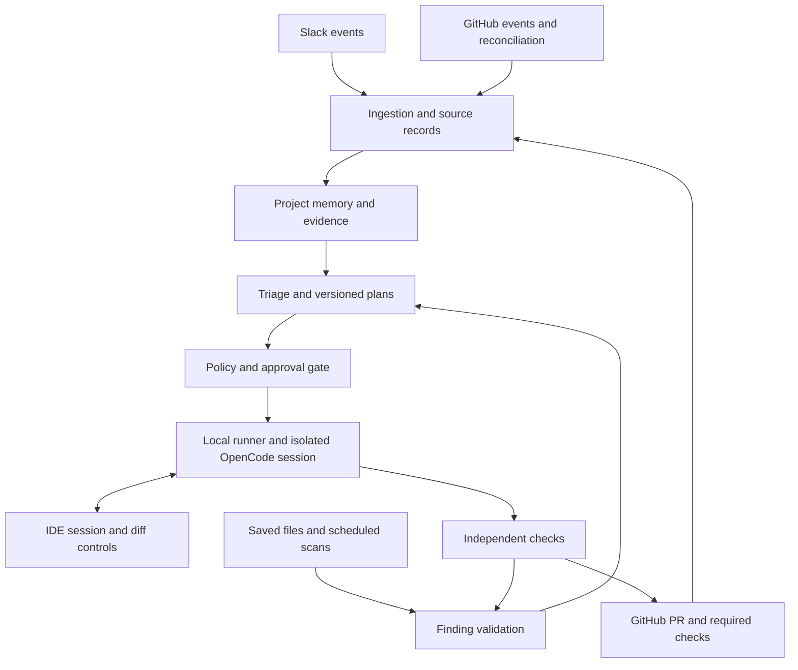

# ShadowQA: System Design and Implementation Plan

Scope: Slack + GitHub + OpenCode. Proposed design, not an implemented or benchmarked system. Technical references checked September 12, 2026.

## 1. Revised problem and solution

### Problem

Development decisions happen in Slack, while implementation, review, and test results live in GitHub. Developers must manually connect these sources, translate discussions into actionable work, and give coding agents the right context. Bugs and missed requirements can persist between local development, pull request review, and merged code.

### Solution

ShadowQA connects selected Slack channels and GitHub repositories, maintains source-linked project context, and turns confirmed requirements and detected issues into development plans. With team-defined permissions, it launches OpenCode sessions in isolated development environments that developers can inspect and control from their IDE.

ShadowQA also runs event-driven and scheduled quality checks during development, on pull requests, and after merges. It verifies findings, prepares fixes, runs tests, and opens pull requests automatically or after approval. Teams can separately enable automatic merging for narrowly defined, low-risk changes that satisfy repository rules.

### Product boundary

The first release is a context-aware development and continuous-repair coordinator for a team's existing workflow. It is not universal AI-chat surveillance, a replacement for GitHub, or a guarantee of bug-free code. Avoid claiming coding agents cannot run proactively: the distinction is ShadowQA's persistent observation, cross-source evidence, policies, and verified repair loop.

In scope: one Slack workspace, explicitly selected channels and repositories, TypeScript/JavaScript repositories first, GitHub issues/PRs/reviews/CI, local saved-file observation, local OpenCode execution, approvals, and post-merge checks.

Out of scope initially: private AI-chat capture, Slack DMs, cross-organization knowledge sharing, production credentials, autonomous database migrations, deployment changes, and production incident recovery. Runtime errors require a later telemetry connector; GitHub alone does not reveal production failures.

## 2. System shape

Build a modular TypeScript service plus a local runner and a thin VS Code extension. Use one PostgreSQL database for application data, full-text retrieval, optional vectors, durable jobs, and an outbound-action queue. Do not begin with microservices, a separate vector database, or a multi-agent framework.

All workflow logic in this document is proposed ShadowQA behavior. Vendor APIs provide the transport and execution primitives, not the complete workflow.

### Components

| Component       | Responsibility                                                        | Does not do                                          |
| --------------- | --------------------------------------------------------------------- | ---------------------------------------------------- |
| Slack adapter   | Receive authorized channel activity and approval interactions         | Read all workspace messages by default               |
| GitHub adapter  | Observe repositories, hydrate PR evidence, publish approved artifacts | Give the model unrestricted GitHub credentials       |
| Event processor | Validate, deduplicate, normalize, track source revisions              | Invoke an LLM before acknowledging delivery          |
| Memory service  | Retrieve facts, requirements, decisions, and supporting sources       | Treat a summary as authoritative truth               |
| Planner         | Produce structured plans and explicit unknowns                        | Authorize execution                                  |
| Policy engine   | Evaluate identities, scope, risk, budgets, and approvals              | Trust a model's self-reported safety score           |
| Job scheduler   | Persist workflow states, dependencies, leases, retries                | Assume messages are delivered exactly once           |
| Local runner    | Prepare isolated code, manage OpenCode, execute bounded jobs          | Edit the developer's active worktree automatically   |
| IDE extension   | Show plan, agent session, findings, diff, pause and cancel            | Carry all long-running work in its extension process |
| QA supervisor   | Run checks, verify findings, initiate bounded repair cycles           | Let the fixing agent certify its own success         |
| Publisher       | Validate and push a patch, create/update a PR, report status          | Merge unless an independent policy permits it        |

## 3. Setup and authorization

1. A workspace administrator installs the Slack app and selects channels. The bot joins only approved channels.
2. A repository administrator installs a GitHub App on selected repositories.
3. An administrator explicitly maps Slack channels to projects/repositories and sets a project audience. Ambiguous mappings require a choice; never infer a write target from a loose name match.
4. Developers sign into ShadowQA and link their Slack/GitHub identities through authenticated flows, not display-name matching.
5. A developer installs the local runner and extension, registers a device, and maps a permitted repository ID to a validated local clone.
6. The administrator approves a repository execution profile: languages, toolchain, dependency-install process, test commands, permitted paths, protected paths, network access, and automation mode.
7. The runner checks Git, the pinned OpenCode version, model availability, sandbox support, and test dependencies. Failed prerequisites leave execution disabled with a specific reason.
8. Default to observation plus approval-based repair. Record baseline failures before enabling automatic fixes.

Keep device credentials in OS credential storage. Use short-lived, repository-scoped execution credentials; keep Slack tokens and GitHub App private keys outside agent environments. Revocation must stop new jobs and cancel or quarantine active jobs.

## 4. Actually observing Slack

Use Slack Bolt with the Events API, not screen capture. For an internal self-hosted pilot, Socket Mode receives events without a public inbound URL. Public Marketplace distribution needs the HTTP route under current Slack rules. [Slack Socket Mode](https://docs.slack.dev/apis/events-api/using-socket-mode/)

Proposed minimum bot scopes: `channels:read`, `channels:history`, `chat:write`, and `app_mentions:read`. Add `groups:read` and `groups:history` only for approved private channels. Add `commands` for slash commands; add user-profile access only if needed. Validate the exact scopes against the methods used during implementation.

Subscribe to channel message events and private-channel equivalents where authorized. Handle thread replies and message-change/delete subtypes. A mention-only integration is insufficient: permitted ordinary channel messages must also be ingested. Exclude DMs and attachments initially.

For each event, record workspace/channel/message IDs, thread timestamp, author, original source time, received time, revision, text, links, and access scope. Upsert by stable source identity and preserve revision metadata. Edits invalidate derived summaries; deletions remove retrievable content and trigger recomputation while retaining only policy-permitted audit metadata.

Persist the inbound event before acknowledging it, then process asynchronously. The HTTP Events API expects acknowledgement within three seconds. Socket Mode uses its envelope acknowledgement mechanism. [Slack Events API](https://docs.slack.dev/apis/events-api/)

Batch a thread after a proposed 20–60-second quiet period. Explicit planning commands can bypass batching. Backfill recent history only within granted access and available history. Maintain a thread cache, use pagination, respect `Retry-After`, and expose missing-history status. Commercial distribution can impose stricter history/replies limits; event capture is the primary path, not repeated full-history polling. [Slack rate limits](https://docs.slack.dev/apis/web-api/rate-limits/)

Messages are evidence, not commands to execute code. A participant saying “we could remove login” becomes a suggestion, not an approved requirement. Decisions become confirmed through authorized confirmation or a preconfigured, auditable source rule. Approval buttons carry a plan ID, version, expiry, and one-use nonce; verify the actor server-side. Emoji reactions are not approvals by default.

## 5. Actually observing GitHub and PRs

Use a GitHub App rather than a shared personal access token. Proposed permissions: metadata read; contents read for observation and write only when publishing; issues and pull requests read/write when commenting or creating work; checks read/write for ShadowQA status; Actions read for authorized workflow information/logs. Do not request administration or workflow-edit rights initially. Validate each endpoint's permissions before shipping.

| Event family                                         | Evidence to refresh                                                 | ShadowQA action                                     |
| ---------------------------------------------------- | ------------------------------------------------------------------- | --------------------------------------------------- |
| `issues`, `issue_comment`                            | Issue text, labels, discussion; PR conversation comments too        | Update requirements or candidate work               |
| `pull_request`                                       | Open/reopen/update/close/merge state, base/head SHAs, changed files | Rebuild affected context and schedule checks        |
| `pull_request_review`                                | Review body, reviewer, state, referenced commit                     | Track requested changes and approvals               |
| `pull_request_review_comment`                        | Inline comment, file, line/diff position, commit                    | Link review feedback to code                        |
| `check_run`, `check_suite`, `workflow_run`, `status` | Results, current commit, available logs                             | Classify failures and verify exact-SHA success      |
| `push`                                               | Updated branch and commits                                          | Refresh indexes and schedule post-merge/main checks |
| Installation/repository-access events                | Installation state and selected repositories                        | Grant or revoke adapter/runner access               |

These event families are documented by GitHub; precise actions and installation permissions must be selected for the app. [GitHub event reference](https://docs.github.com/en/webhooks/webhook-events-and-payloads)

Webhook payloads are triggers, not a complete PR archive. Fetch paginated PR files, reviews, comments, check results, and authorized logs as needed. Handle truncated/binary patches by using a bounded local diff between explicit SHAs. Ignore stale CI results for previous heads. Reconcile unresolved review-thread state through the appropriate API when needed.

Verify `X-Hub-Signature-256` against the raw request body using constant-time comparison, reject invalid payloads, and deduplicate delivery IDs. [GitHub webhook validation](https://docs.github.com/en/webhooks/using-webhooks/validating-webhook-deliveries)

Run periodic reconciliation of open PRs, branch heads, and recent issues/checks to recover missing deliveries. Track source cursors and known gaps; do not promise every historical event can be recovered. Self-generated events still update state, but origin and causal IDs prevent recursive replanning. Observe other bots' test reports rather than dropping all bot messages.

## 6. Database and shared context

Use PostgreSQL as the authoritative state store. Begin with exact references and full-text search; add pgvector for semantic matching after basic retrieval works. It supports vector search within Postgres, avoiding an extra database. [pgvector](https://github.com/pgvector/pgvector)

| Tables                                         | Essential fields                                                             |
| ---------------------------------------------- | ---------------------------------------------------------------------------- |
| `tenants`, `memberships`, `identities`         | Tenant, role, linked provider IDs, status                                    |
| `projects`, `repositories`, `channel_mappings` | Audience, repository ID, default branch, channel scope                       |
| `connections`, `source_cursors`                | Installation ID, encrypted secret reference, sync health, watermark          |
| `source_events`                                | Provider delivery ID, tenant, type, received/source times, payload reference |
| `source_documents`, `source_revisions`         | Stable source ID, revision/hash, text, URL, ACL, tombstone                   |
| `knowledge_items`, `evidence_links`            | Type, statement, state, source revision, project, owner, supersedes          |
| `code_index`                                   | Repo, commit SHA, path, symbol, content hash, embedding version              |
| `tasks`, `task_dependencies`                   | Intent, trigger, priority, status, owner, dependency IDs                     |
| `plans`, `plan_steps`, `context_snapshots`     | Immutable version, source revisions, base SHA, tests, risks, digest          |
| `policies`, `approvals`                        | Scope, policy version, actor, plan/diff digest, expiry, decision             |
| `runners`, `jobs`, `job_events`                | Capabilities, lease, fencing token, run/session IDs, state                   |
| `findings`, `finding_occurrences`              | Fingerprint, rule, evidence, affected SHA, severity, resolution              |
| `artifacts`, `pull_requests`                   | Diff/log/check hashes, branch, PR ID, tested head SHA                        |
| `outbox`, `audit_log`                          | Idempotent action key, attempts, delivery state, authorized actor            |

Knowledge types: requirement, decision, constraint, question, bug, implementation fact, review request. States: suggested, confirmed, disputed, superseded, resolved. Keep semantic similarity separate from truth and permission.

Every row and retrieval query is tenant-scoped. Apply project/repository/source access filters before vector or text retrieval. Derived summaries inherit the intersection of their sources' audiences. A private Slack decision cannot be quoted into a public PR merely because the bot can access both. Publishing requires an explicit safe summary or declassification by an authorized person; redacting secrets alone is insufficient.

Planning retrieval order: exact issue/PR/thread links; confirmed current requirements; recent relevant discussions; affected repository symbols and tests; related findings and historical fixes. Return source-linked excerpts with timestamps and SHAs, not the entire archive. Record missing sources and contradictory decisions. A model cannot resolve an authority conflict by choosing whichever message is newest.

Source removal and revoked access invalidate cached snapshots for future use. Retention deletion must cover source text, embeddings, derived summaries, logs, and eventual backup expiry. Keep minimal non-content audit records where permitted.

## 7. Reasoning and planning pipeline

Use bounded model calls and typed outputs, not an indefinitely running “manager agent.” Persist inputs, concise decision rationale, source citations, model/version, and schema-valid output; private chain-of-thought is neither needed nor a product artifact.

1. Normalize events and collapse duplicates using deterministic code.
2. Extract candidate requirements, decisions, questions, and findings into a JSON schema. Invalid output gets one repair attempt, then becomes a visible extraction failure.
3. Resolve repository and issue links. Block ambiguous write targets.
4. Retrieve an access-filtered context snapshot tied to source revisions and a repository SHA.
5. Triage: record-only, ask a question, propose task, or investigate a finding. Normal conversation must not generate endless tasks.
6. Inspect relevant code read-only through the runner. A plan without repository inspection is a draft, not execution-ready.
7. Generate a versioned plan with ordered dependencies and objective acceptance checks.
8. Validate file references, commands, scope, permissions, costs, contradictions, and freshness in ordinary code.
9. Send the plan to the approval gate or the explicitly configured automatic policy.

Required plan fields: task/repository IDs, source links and revisions, objective, exclusions, base SHA, expected paths, dependency steps, acceptance criteria, approved command-profile ID, regression test strategy, risk flags, rollback approach, estimated resource cap, unanswered questions, and plan digest.

An LLM-proposed shell string is never directly elevated into a trusted execution profile. Commands come from administrator-reviewed profiles. High-impact unknowns block execution; low-impact assumptions are displayed explicitly.

After a material requirement change, base change, or plan change, regenerate and invalidate approvals. Do not silently execute a newer plan using approval for an older one.

## 8. Launching a real OpenCode agent in the IDE

The runner owns execution; the IDE is its attached interface. This allows an approved background run to continue after an editor closes, provided the runner and machine remain online. Interactive-only mode pauses when no developer is attached. If the machine is asleep, jobs wait; a browser dashboard cannot run code on a sleeping computer.

OpenCode provides a server and JS/TS SDK for programmatic sessions. ShadowQA should wrap the SDK in a version-pinned adapter with startup contract tests. [OpenCode SDK](https://opencode.ai/docs/sdk/)

### Execution sequence

1. The runner establishes an authenticated outbound connection to ShadowQA; do not expose a laptop port publicly.
2. It leases an approved job bound to tenant, repo, base SHA, plan hash, policy version, expiry, and resource limits.
3. It verifies the signature/session identity, local repository mapping, available model, disk capacity, and sandbox policy. Server-provided arbitrary filesystem paths are not trusted.
4. It acquires a repository execution lock. Start with one mutation job per repository.
5. It creates a branch and isolated checkout/worktree at the approved SHA. The developer's working files stay untouched.
6. It starts an authenticated OpenCode server associated with that workspace and safe configuration. Pin the directory context rather than relying on the IDE's current folder.
7. It creates a session, records the session ID before prompting, submits the approved task plus bounded context, and subscribes to progress events.
8. The extension offers “Open agent session,” opening the isolated workspace and an integrated terminal attached to the same backend/session. It also shows the current plan, diff, approvals, and findings.
9. The runner executes policy-approved checks, collects the diff, and records tool failures independently of the agent's final message.
10. The publisher revalidates the patch and permissions, creates a commit, pushes the dedicated branch, and opens or updates its PR.

The API exposes session creation, asynchronous prompts, event streaming, status, diffs, and abort. Use those through the pinned adapter rather than clicking the IDE UI. [OpenCode server](https://opencode.ai/docs/server/)

For an attached terminal, the documented pattern is `opencode attach <local-url> --session <session-id> --dir <workspace>`. Pass credentials through a secure process environment, not visible command arguments. The extension must not start an unrelated second session. OpenCode supports integrated IDE terminals; ShadowQA's extension adds the job binding and review controls. [OpenCode CLI](https://opencode.ai/docs/cli/), [IDE integration](https://opencode.ai/docs/ide/)

In a sandboxed container/VM, keep the server bound to its private interface and expose only an authenticated loopback proxy to the IDE. Mount or open the same isolated files using the editor's remote workspace support. Do not expose the host's home directory, SSH agent, Docker socket, or production environment.

### Job states and recovery

`proposed → awaiting_approval → queued → leased → preparing → running → verifying → ready_to_publish → pr_open → merged → monitoring → resolved`

Additional explicit states: `blocked`, `waiting_for_runner`, `quota_paused`, `cancelled`, `failed`, `superseded`. A failed verification can return to a bounded repair attempt, not silently become successful.

Proposed defaults: heartbeat every 10 seconds; 60-second lease; 20-minute run timeout; two repair attempts; one active code-writing job per repo. Make these configurable and measure before increasing them.

Use fencing tokens to reject stale runner results after lease reassignment. On disconnect, reconcile recorded sessions and workspace state before retrying. Resume or quarantine an existing run; do not blindly launch a duplicate. A cancel request aborts OpenCode and terminates its sandbox process group after a grace period. Preserve the partial diff for inspection.

## 9. Continuous QA and automatic repair

This is a standing supervisor, not another prompt added to a one-time coding task. It has its own triggers, scan schedules, durable findings, verification rules, and repair budget.

| Trigger                           | Checks                                                            | Response                                 |
| --------------------------------- | ----------------------------------------------------------------- | ---------------------------------------- |
| Developer saves a file            | Debounced syntax/type/lint checks and selected tests              | IDE diagnostic; candidate finding        |
| OpenCode completes a change batch | Changed-file checks and relevant regression tests                 | Bounded repair or blocked run            |
| PR opens or head changes          | Diff checks, acceptance coverage, tests, dependency/secret checks | Update status and source-linked findings |
| PR receives requested changes     | Inspect current code against specific review request              | Propose or approve-scoped repair         |
| CI fails                          | Classify code failure versus environment/flaky failure            | Reproduce before proposing a fix         |
| Default branch changes            | Smoke/regression checks for the new SHA                           | Follow-up fix PR if verified             |
| Scheduled scan                    | Broader tests and supported dependency/security scans             | Deduplicated findings and triage         |

Suggested initial cadence: local checks after 5–15 seconds of inactivity, changed-code checks per PR SHA, nightly broader scans only when a runner is available. “Continuous” means event-driven plus scheduled work, not running every analyzer every second.

Local observation requires explicit folder consent. Watch saved files initially, not keystrokes or unsaved buffers. Snapshot relevant saved content before a scan; results belong to that snapshot and become stale on further edits. Exclude generated folders, dependencies, credentials, and oversized files. Never modify a developer's uncommitted files automatically. Require a commit/stash choice or an explicit reviewed patch transfer before fixing dirty local work.

Start with the repo's existing compiler, linter, test runner, and build. Add an open-source secret scanner and dependency scanner only after checking licenses and ecosystem support. LLM review supplements these checks for requirement mismatches; it is not proof that code is incorrect.

### Finding-to-fix loop

1. Capture detector, source, exact SHA/content hash, rule, location, sanitized failure output, and severity.
2. Fingerprint by repository, rule, symbol/location, and normalized failure signature. Link repeat occurrences instead of creating duplicate PRs.
3. Compare baseline and changed code. Mark pre-existing failures; do not attribute them to the new PR automatically.
4. Reproduce when practical. For a regression, establish a failing test on the affected version; verify it passes after the patch. Static-rule findings carry the original rule evidence. Unreproduced model suspicions remain unverified.
5. Retrieve related Slack requirements, GitHub discussions, and previous attempted fixes.
6. Produce a scoped repair plan and evaluate policy.
7. Launch a separate OpenCode repair session against the specified SHA.
8. Run original failing checks, regression tests, and required broader checks in a fresh verification environment.
9. Publish only after scope checks. If attempts fail, stop and report the evidence; do not increase permissions or weaken tests.
10. Track PR outcome and post-merge checks. Distinguish fix proposed, locally verified, merged, and verified on main.

Do not let the repair agent disable the original failing check, remove assertions, broaden permissions, edit CI to manufacture success, or rewrite the baseline automatically. Legitimate test changes must be justified and reviewed. A worktree prevents file conflicts but is not a security sandbox.

Keep repair lineage, cooldowns, daily job caps, and a workspace kill switch. Agent-generated commits should trigger validation, but not unlimited new repair jobs. A recurring failure after two attempts escalates to a human.

## 10. Automation modes

| Mode               | Observe and diagnose | Edit code                  | Open/update PR               | Merge                                                     |
| ------------------ | -------------------- | -------------------------- | ---------------------------- | --------------------------------------------------------- |
| Observe            | Automatic            | No                         | No fix PR                    | Never                                                     |
| Approval-based     | Automatic            | Approved plan only         | Under approved scope         | Human                                                     |
| Auto-fix           | Automatic            | Allowlisted low-risk plans | Automatic after verification | Human                                                     |
| Full-auto, bounded | Automatic            | Allowlisted low-risk plans | Automatic after verification | Only if repository rules and explicit merge policy permit |

Full-auto means no per-task approval within preauthorized boundaries, not unrestricted shell access or production deployment. Branch protection and required reviewers remain authoritative; if a human review is mandatory, that task cannot auto-merge.

Initial automatic scope should be deliberately small: trusted repository code, approved check profiles, limited patch size, limited paths, no new dependencies, no public-interface changes. Documentation/formatting fixes can qualify; changing tests still requires scrutiny. Model confidence is not a security gate.

Always require review for authentication, authorization, billing, migrations, secrets, infrastructure, CI configuration, destructive operations, dependencies, and broad API changes. Compute risk flags from touched paths and patch content as well as the plan.

Execution approval is tied to a plan/base digest. Merge approval is tied to the actual tested diff/head SHA. Immediately before publishing/merging, check actor access, policy version, repository head, required checks, approvals, and path restrictions again. New commits invalidate stale checks and approvals according to policy.

Do not auto-merge into someone else's PR branch. A repair to a human-owned PR requires explicit collaborator permission; otherwise create a linked fix branch/PR against an approved target. Preserve human commits.

## 11. Security boundaries

- Treat Slack text, PR descriptions, code comments, repository instructions, and logs as untrusted input. They cannot change ShadowQA policy or request secrets.
- Separate the planner, code sandbox, verifier, and credential-holding publisher. GitHub/Slack write actions flow through checked service methods, not general model tools.
- OpenCode permission settings are a useful additional gate, not a substitute for OS isolation. Audit repo/global config, plugins, MCP servers, and scripts before trusting a repository execution profile. [OpenCode permissions](https://opencode.ai/docs/permissions/)
- Use non-root ephemeral containers or stronger isolation for untrusted code, minimal mounts, resource limits, and default-deny network access. Dependencies and test scripts execute code; sandbox them too. Fork PRs never receive trusted secrets.
- Do not attach arbitrary public self-hosted CI jobs to a developer machine. Keep the runner dedicated to registered repositories and validated jobs.
- Exclude secrets from indexing, model context, logs, and artifacts. Sanitization occurs before external inference or publication.
- Protect against path traversal, symlink escape, stale approvals, replayed jobs, unauthorized runner registration, and cross-tenant object IDs.
- Require authenticated loopback IPC for the extension/runner and encrypted authenticated transport for remote coordination. Do not rely on localhost alone for authorization.
- Audit who approved what, source/plan/diff hashes, job identity, publisher actions, and final outcome. Never log credentials.

## 12. Free-first model and deployment strategy

### Models

Use a provider interface for extraction, planning, review, coding, and embedding; configure each independently. Local inference through Ollama is the default, with an appropriately licensed model chosen by evaluation on actual hardware. Ollama supplies a local API, not model-quality guarantees. [Ollama API](https://docs.ollama.com/api/introduction)

Do deterministic filtering first, summarize only changed threads, cache content hashes, retrieve bounded excerpts, and serialize expensive model jobs. Use a small model for extraction and a stronger local model for planning/coding if hardware permits. Benchmark tool calling, context capacity, task success, memory use, and latency before committing to a model. Check each model's license separately from the inference runtime.

Gemini is optional, not the foundation. Its unpaid service terms warn against confidential/personal input and require API users to be 18 or older; this rules it out as a default for the proposed under-18 builder and private team context. Do not use someone else's account to bypass eligibility. [Gemini API terms](https://ai.google.dev/gemini-api/terms)

For eligible future deployments, any external provider still needs explicit data-policy approval. Free quota is finite; queue on exhaustion or use an explicitly approved local fallback, never silently enable billing. Availability and pricing depend on the model. [Gemini API pricing](https://ai.google.dev/gemini-api/docs/pricing)

### Deployment profiles

| Profile                            | Event intake                                                        | Compute/storage                                                          | Limitation                                                 |
| ---------------------------------- | ------------------------------------------------------------------- | ------------------------------------------------------------------------ | ---------------------------------------------------------- |
| Zero-new-service-spend local pilot | Slack Socket Mode; authenticated periodic GitHub API reconciliation | Existing machine, local Postgres and model, local runner                 | GitHub detection is delayed; laptop sleep interrupts work  |
| Webhook pilot                      | Slack Socket Mode or HTTP; GitHub signed webhooks                   | Existing always-on host with reachable HTTPS, or explicitly chosen relay | Reachable ingress and uptime must actually be supplied     |
| Self-hosted team service           | HTTP webhooks plus reconciliation                                   | Team-owned always-on host and registered runners                         | Hardware, electricity, maintenance, backups are real costs |

For local polling, explicitly query PR heads, reviews/comments, issues, checks, and workflow results with per-source cursors, pagination, caching and rate-budget backoff. Do not assume a generic repository event feed contains everything. A proposed 1–5-minute interval is configurable and must respect actual API limits.

Do not claim a Docker container on a laptop is publicly reachable or that an unnamed free host solves ingress. The local polling profile works without an inbound public endpoint; webhook deployment is a separate operational choice.

Open-source components can cover the full feature path, but not eliminate compute/operations costs or guarantee frontier-level coding quality. The earlier “80–90%” estimate had no measured basis and should not be used for budgeting.

## 13. Proposed internal API and code organization

External webhooks: `POST /webhooks/slack`, `POST /webhooks/github`. Socket Mode is an alternative Slack adapter.

Application API: `GET /projects/:id/context`, `GET /tasks/:id`, `POST /tasks/:id/plan`, `POST /plans/:id/approvals`, `POST /jobs/:id/cancel`, `GET /findings`, `POST /findings/:id/suppress`.

Runner API: `POST /runners/register`, `POST /runners/:id/heartbeat`, `POST /jobs/lease`, `POST /jobs/:id/events`, `POST /jobs/:id/artifacts`, `POST /jobs/:id/complete`. Apply tenant/device authorization, lease and fencing checks to each job call. Support an outbound event stream for dispatch hints; the database remains authoritative.

Suggested packages: `contracts`, `db`, `slack-adapter`, `github-adapter`, `memory`, `model-router`, `planner`, `policy`, `scheduler`, `opencode-adapter`, `qa`, `publisher`. Applications: `api`, `worker`, `runner`, `vscode-extension`, `dashboard`.

Use schema validation at every boundary. Keep API/worker modules deployable together initially. Store large sanitized logs/diffs on local disk with database metadata and hashes; later add object storage if needed.

Optional later MCP interface: read-only `search_project_context`, `get_task`, `get_decision`, and scoped `report_finding`. MCP can expose context to additional clients, but it neither observes Slack automatically nor replaces ShadowQA's scheduler and authorization.

## 14. Reliability and operating controls

Persist inbox event and processing job atomically. Persist state changes and outbound intents in one database transaction. Workers lease durable jobs with bounded retries and backoff; poison messages go to a visible failed queue. External effects are at-least-once with idempotency keys and reconciliation, not imaginary exactly-once delivery.

Use a stable job marker/branch to find an existing PR before creating another after a crash. Record remote IDs as soon as available. Serialize publisher mutations and reject results with expired fencing tokens. After a force push, rebuild code references and recheck affected approvals.

Record ingestion delay, source-sync gaps, queue age, model failures/tokens, runner availability, execution duration, repeated findings, repair success, false-positive rate, PR acceptance, and regression rate. Display degraded observation plainly; “no findings” is different from “no runner available.”

Perform encrypted backups and restore drills. Set initial retention explicitly, for example 30 days for raw content and 90 days for sanitized run artifacts, subject to team/source policy. Avoid storing permanent copies simply because source access was once granted.

## 15. Implementation sequence and release gates

### Phase 0: prove execution

Use one fixture repo. Create a job, launch an isolated OpenCode session, attach the exact session in VS Code, perform a small change, run a test, show the diff, and cancel a second run. Pin tested versions. Gate: reproducible execution and cancellation with no modifications to the primary worktree.

### Phase 1: prove observation

Add Slack message/thread/edit/delete ingestion and GitHub PR/review/check ingestion plus reconciliation. Build source-linked context without code execution. Gate: duplicate events are harmless, edits are reflected, deleted/revoked content disappears from retrieval, and a PR-head change produces an updated record.

### Phase 2: prove grounded planning

Add repository inspection, schema-validated task extraction, conflict handling, source snapshots, and approval UI. Gate: an ambiguous request asks a question; a confirmed Slack decision produces a plan citing both the discussion and actual repository files.

### Phase 3: connect approved plans to PRs

Add runner pairing, durable leases, isolation, verification, credential-separated publication, and status reporting. Gate: Slack discussion produces an approved plan, a visible IDE session, a tested branch, and exactly one linked PR despite a simulated delivery retry.

### Phase 4: ship continuous QA

Add local saved-file checks, PR/CI triggers, scheduled/post-merge scans, findings, reproduction, and bounded repair. Gate: detect a planted regression without a new user prompt, reproduce it, propose/fix under policy, and report verified outcome. Distinguish a flaky/environment failure from a proven code regression.

### Phase 5: restricted automatic repair

Enable auto-fix PRs for explicitly configured cases only after measuring false positives and repair quality. Add full-auto merge only after stale-head, authorization, adversarial-input, and rollback tests pass. Do not set a launch date based only on how quickly a demo works.

### Required acceptance tests

| Scenario                                       | Expected behavior                                         |
| ---------------------------------------------- | --------------------------------------------------------- |
| Duplicate Slack/GitHub event                   | One logical update and no duplicate job/PR                |
| Out-of-order edit or stale CI success          | Newest valid revision and exact-head checks prevail       |
| Deleted/private/revoked source                 | No unauthorized retrieval or publication                  |
| Malicious Slack instruction requesting secrets | Treated as untrusted content; no privilege change         |
| PR contains hostile install/test scripts       | Runs only in approved isolation without trusted secrets   |
| Human edits local files during scan            | Old diagnostic marked stale; no file overwrite            |
| Runner loses connection or crashes             | Job reconciled before resume; no duplicate executor       |
| Plan or base changes after approval            | Execution pauses for refreshed validation/approval        |
| Agent claims tests passed when process failed  | Verification fails                                        |
| Agent removes failing assertion                | Scope/policy gate blocks publication                      |
| Model quota exhausted                          | Visible pause or approved fallback; no billing activation |
| Two repair attempts fail                       | Escalate; no infinite fix loop                            |
| Automatic merge faces required review          | Respect branch rules and wait                             |
| Source private, destination public             | Publishing blocked without explicit permitted summary     |

## 16. First complete demo

A developer reports a duplicate-submission bug in an approved Slack channel. ShadowQA captures the thread, links the relevant open GitHub PR, reads its diff and failing test result, and inspects the affected code. It produces a plan with source links, acceptance criteria, and an explicit SHA. A permitted developer approves it. The registered runner creates an isolated workspace and OpenCode session; the IDE opens that exact session. OpenCode adds a regression test and fix. The verifier confirms the original failure and the passing patch. ShadowQA opens one fix PR and reports its checks in the Slack thread.

Later, another PR reintroduces the regression. A standing check detects it without a new prompt. ShadowQA records the finding, follows the configured repair policy, and opens a verified repair PR or asks for approval. After merge, it runs post-merge checks and records the exact outcome. That is the complete product loop to prove before adding more source integrations.  
  
REVISIONS TO PLAN: Ensure there is minimal frontend, should be no web app frontend or UI, but instead a simple CLI with clean UI/showy glyphs/designs where you can showing approvals, auto mode, and everything else in the IDE. The tool would be storing context until a CLI command is run, user/team presses "Compile context, generate plan", then user approves (or it does it automatically depending on mode), etc, etc, something like that. Instead of local model from Ollama, use Gemini free tier API.
## 17. Addendum — ShadowQA Live and the individual edition

The loop in §16 proves the code before it ships. Two gaps remained after it worked.

**The individual gap.** A developer working alone has the same drift problem the team has, but the
"Slack" is a ChatGPT tab and a Claude tab that have never met, plus a Claude Code or Codex session on
the laptop. Decisions made in one conversation are absent from the next, and the agent that finally
writes the code sees none of them. The individual edition (`shadowqa-individual`) reads the
conversations the developer chooses to track — through a browser side panel for ChatGPT and Claude
and a native companion for Claude Code and Codex — extracts requirements, decisions and open
questions with citations, and compiles a Gemini plan grounded in the repository. The plan runs in the
developer's own coding tool (OpenCode, Claude Code or Codex) inside the IDE terminal, in a session
they can step into, and is verified in a fresh copy before a branch is written. Same four modes,
same gates, same findings list.

**The runtime gap.** Checks and plans cover the code that exists; nothing watched the application
actually running. ShadowQA Live is the product's autonomous fixer for that. A browser SDK (or a
Chrome extension that injects it into localhost pages) records clicks, requests, console output and
exceptions. A Python bridge joins the failing click, the request it caused and the exception it
produced into one incident, maps minified frames back to source, and asks Claude (GPT as the
fallback) for a root cause and a minimal patch. The patch is graded LOW / MEDIUM / HIGH by
deterministic rules; the project's automation mode decides whether it waits. Behind a Git
checkpoint the workspace's linters and tests run, then the recorded interaction is replayed against
the running app; a failed replay rolls back automatically, and a passing one becomes a pull request.

**One product.** Live is not a second tool. It starts from the ShadowQA CLI (`shadowqa live start`),
reads the project's mode from the service, reports every incident as a finding
(`detector: "live"`) so it appears beside check failures in `shadowqa findings`, and takes
`approve` / `undo` / `pr` / `dismiss` from the same CLI. `shadowqa repair` on a Live finding
delegates to the bridge under the same mode rules. Planning stays on Gemini; Live's diagnosis is
Anthropic first and OpenAI second because that is what its detector was built and tuned on.

The brand was redone at the same time so that the CLI, the extensions, the Live overlay, the film
and the deck read as one thing: charcoal and off-white only, red for wrong and green for right,
Work Sans and Source Serif Pro. See `docs/BRAND.md`.
